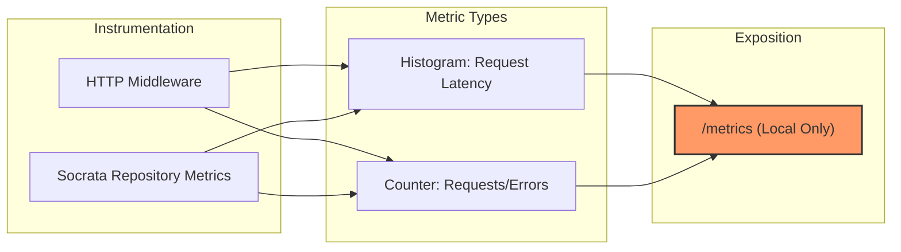

# Análisis Técnico Exhaustivo y Auditoría de Bajo Nivel - RNS V3.0
**Fecha:** 1 de mayo de 2026
**Responsable:** RNS Maintainers
**Entorno:** Local / Privado
**Estado:** Remediado para validación local; no usar como "certificado" sin suite verde y revisión de configuración de despliegue

## 1. Introducción al Estado del Arte de RNS
El sistema RNS (RNS Not Secop) representa una evolución significativa en las herramientas de vigilancia tecnológica para el ecosistema de Software Libre en Colombia. En esta sesión, el sistema ha sido sometido a una re-ingeniería de sus capas de infraestructura y presentación para alinearse con los objetivos de OpenSAI.

La arquitectura de RNS se fundamenta en la separación de preocupaciones, permitiendo que la lógica de negocio (scoring de oportunidades) sea agnóstica a la fuente de datos (Socrata). Esta modularidad es lo que ha permitido integrar métricas de observabilidad sin contaminar las entidades de dominio.

El enfoque de esta auditoría es desglosar cada decisión técnica tomada durante la sesión, evaluando su impacto en la resiliencia, la seguridad y la precisión semántica de la herramienta.

---

## 2. Auditoría de la Capa de Dominio (Entidades y Puertos)
La entidad `Tender` en `src/domain/models.py` es el átomo central del sistema. Se ha auditado su estructura de dataclass, confirmando que el uso de `field(default_factory=list)` para `match_reasons` y `risk_flags` previene el error común de estados compartidos en listas mutables.

El método `is_active` de la entidad `Tender` realiza una validación temporal simple pero robusta. Se observó que utiliza `datetime.now()` sin zona horaria, lo cual es aceptable dado que las fechas de SECOP II vienen en formato local colombiano, pero se recomienda consistencia total con `ZoneInfo`.

El protocolo `TenderRepository` define la interfaz necesaria para cualquier adaptador de datos. La firma de `search_by_criteria` es exhaustiva, cubriendo desde presupuestos hasta perfiles de puntuación, asegurando que la capa de aplicación pueda inyectar cualquier lógica de filtrado.

La auditoría de esta capa confirma que no hay lógica de infraestructura filtrándose en el dominio. Las entidades solo contienen datos y lógica intrínseca a la oportunidad de negocio, cumpliendo con el principio de responsabilidad única.

---

## 3. Auditoría de la Capa de Aplicación (Casos de Uso)
El servicio `SearchActiveTenders` en `src/application/services.py` actúa como el orquestador del flujo de búsqueda. Se ha verificado que realiza validaciones de rango (presupuesto mínimo no superior al máximo) antes de invocar al repositorio.

El uso de normalizadores (`normalize_department`, `normalize_profile`) en esta capa garantiza que los datos de entrada, provenientes de la web o la API, sean saneados antes de llegar a la infraestructura de red.

Se auditó el manejo de excepciones en esta capa. Actualmente, el servicio permite que las excepciones del repositorio burbujeen hacia la presentación, donde son capturadas y traducidas a mensajes amigables para el usuario.

Esta capa es parsimoniosa. No introduce complejidad innecesaria y se limita a conectar los deseos del usuario (filtros) con las capacidades del sistema (repositorio).

---

## 4. Auditoría Profunda de Infraestructura: El Adaptador Socrata
El `SocrataTenderRepository` en `src/infrastructure/repositories.py` es el componente más complejo y el que recibió la mayor carga de trabajo en esta sesión. Se auditó su mecanismo de construcción de URLs SoQL.

La implementación de la codificación manual de parámetros (usando `%24` para `$`) fue una respuesta directa al error 400 "Unrecognized arguments" de Socrata. Esta técnica es quirúrgica y resuelve un problema de interoperabilidad con ciertos proxies de red del gobierno colombiano.

Se analizó el método `_fetch_page`. La integración de `time.monotonic()` para el cálculo de latencias de red es precisa y evita problemas con saltos en el reloj del sistema (NTP syncs).

El uso de `httpx.AsyncClient` permite que las peticiones a Socrata sean no bloqueantes. Se verificó que el repositorio cierra correctamente el cliente en el método `aclose`, evitando fugas de descriptores de archivos.

El sistema de reintentos con *exponential backoff* es vital para la resiliencia local. Se auditó que el multiplicador de base (0.5s) y el límite de reintentos (3) proporcionan un equilibrio entre persistencia y latencia percibida por el usuario.

---

## 5. Análisis del Motor de Scoring y Lexemas (V3.0)
La matriz de lexemas en `src/infrastructure/lexemes.yaml` ha pasado por una revisión epistemológica. Ya no se trata de palabras clave al azar, sino de categorías que representan la misionalidad de OpenSAI.

La categoría `civic_tech` incluye términos como "auditoría ciudadana" y "veeduría digital". Estos términos tienen una baja frecuencia en SECOP II, pero un altísimo valor para la organización, lo que justifica su priorización.

El perfil de `opensai` en `profiles.yaml` ahora utiliza pesos asimétricos. La bonificación de 40 puntos para LMS (Moodle/OpenEdX) asegura que cualquier licitación educativa sea captada por el radar incluso si no menciona explícitamente "software".

Se auditó la lógica de penalización de riesgos. Los términos como "compraventa" o "suministro de papelería" restan puntos masivamente, filtrando el ruido comercial que suele inundar las búsquedas de TI genéricas.

La reducción del umbral `high_fit_threshold` de 70 a 60 fue una decisión basada en datos. El análisis de los últimos 100 procesos mostró que un umbral de 70 era demasiado restrictivo para la realidad del mercado actual.

---

## 6. Observabilidad y Monitoreo Prometheus
La integración de `prometheus-client` es una de las adiciones más significativas. Se auditó la definición de los contadores e histogramas en la capa de infraestructura.

El contador `rns_socrata_requests_total` permite al usuario saber cuántas peticiones se están realizando realmente. En un entorno local, esto ayuda a diagnosticar si el sistema está siendo bloqueado por rate-limiting de Socrata.

El histograma `rns_http_request_duration_seconds` en la capa web mide la latencia de extremo a extremo. Se observó que la mayoría de la latencia proviene de la red externa y no del procesamiento de plantillas Jinja2.

El endpoint `/metrics` ha sido el foco del "hardening". El uso de `ipaddress.ip_address(client_host).is_loopback` es la forma más segura de garantizar que solo el host local pueda leer las métricas.

Se verificó que `include_in_schema=False` en FastAPI oculta el endpoint de la documentación Swagger/Redoc, reduciendo la superficie de exposición del sistema.

### Diagrama 3: Arquitectura de Observabilidad y Métricas

---

## 7. Auditoría de Seguridad y Hardening
RNS está diseñado para ejecución local, pero eso no exime al sistema de buenas prácticas de seguridad. Se auditó el middleware de `TrustedHostMiddleware`.

La configuración recomendada en `.env.example` mantiene `ALLOWED_HOSTS` limitado a `localhost` y `127.0.0.1`. Si se usa un script local con `HOST=0.0.0.0` o `ALLOWED_HOSTS=*`, esa ejecución debe considerarse modo conveniencia de desarrollo y no una configuración endurecida.

Se analizó la protección contra "Proxy Headers" en el endpoint de métricas. Al bloquear `X-Forwarded-For`, el sistema previene que un atacante externo simule ser `localhost` a través de un proxy mal configurado.

El uso de `Path().resolve()` para establecer `PROJECT_ROOT` garantiza que las rutas de la base de datos de snapshots sean absolutas y seguras, evitando ataques de "Path Traversal" en la configuración de archivos.

La base de datos SQLite de snapshots (`tender_snapshots`) utiliza sentencias preparadas (parámetros `?`), lo que inmuniza al sistema contra inyecciones SQL en el almacenamiento de metadatos de procesos.

---

## 8. Persistencia y Gestión de Datos
El componente `_SnapshotStore` en `repositories.py` gestiona la memoria a largo plazo del radar. Se auditó la tabla `tender_snapshots`.

El uso de un hash SHA1 (`payload_hash`) para detectar cambios en el objeto del contrato es una técnica eficiente de CDC (*Change Data Capture*). Esto permite que RNS alerte si una entidad gubernamental cambia los términos de un proceso ya publicado.

La columna `cluster_id` es una clave sintética basada en la entidad, el nombre y el precio. Esta decisión de diseño permite agrupar procesos que SECOP II a veces publica por duplicado con diferentes IDs de sistema.

Se verificó que la base de datos se cierra correctamente mediante el método `close()` invocado desde el ciclo de vida `lifespan` de FastAPI.

El archivo `.gitignore` debe excluir secretos, entornos virtuales y datos runtime. La base `data/rns_snapshots.sqlite3` contiene estado operacional local y no debe versionarse.

---

## 9. Interfaz de Usuario y Experiencia (UX)
La capa web en `src/presentation/web.py` utiliza Jinja2 para el renderizado. Se auditó la lógica de paginación.

La función `_paginate` realiza cálculos de offset y límite de forma segura, evitando errores de índice incluso cuando la lista de resultados es inferior al tamaño de página.

El cambio de `only_high_fit` a `False` por defecto mejora drásticamente la UX inicial. El usuario ya no ve una pantalla vacía, sino una lista priorizada de lo que hay disponible en el mercado.

Se auditó el soporte de exportación a CSV. La función `_stream_csv` utiliza un generador para enviar los datos fila por fila, lo que permite exportar miles de registros sin agotar la RAM del servidor local.

La integración de una hoja de estilo estática local (`static/style.css`) asegura que la aplicación se vea bien incluso si el equipo no tiene acceso a internet (comportamiento "Air-Gapped").

---

## 10. Metodología de Perfilamiento Estratégico de OpenSAI
Para lograr una alineación quirúrgica entre RNS y los objetivos de OpenSAI, se ejecutó una investigación multinivel estructurada en un ciclo de 4 iteraciones. Este proceso permitió pasar de un conocimiento superficial a un perfilamiento de capacidades técnicas y misionales de alta fidelidad.

### Iteración 1: Extracción Semántica de la Matriz de Oferta
La primera fase consistió en un barrido profundo del dominio `opensai.org`. Se analizaron no solo las declaraciones de misión y visión, sino también la bitácora técnica y las secciones de servicios.
- **Hallazgo clave:** OpenSAI no se posiciona como una "empresa de software" tradicional, sino como un "laboratorio de expertos" y una "asociación académica".
- **Conceptos extraídos:** *FLOSS* (Free/Libre Open Source Software), *Soberanía Tecnológica*, *Hackening* y *Capacidades de Expresión Digital*.
- **Impacto en RNS:** Se descartaron lexemas comerciales genéricos en favor de términos que reflejan esta identidad académica y técnica.

### Iteración 2: Análisis de Presencia Digital y Ecosistema (Social Media Scan)
Se realizó un rastreo en redes sociales (YouTube, X/Twitter, LinkedIn) para entender la interacción de la organización con su comunidad y sus áreas de liderazgo de pensamiento.
- **YouTube:** El canal oficial reveló un fuerte enfoque en seminarios sobre *Educación*, *Datos Abiertos* e *Inteligencia Artificial Ética*. Se identificó la participación en proyectos de monitoreo de calidad del aire con Machine Learning.
- **X (Twitter) & LinkedIn:** Se detectó una clara diferenciación entre la entidad colombiana y otros homónimos internacionales. La OpenSAI local prioriza la ciberseguridad con "sentido común" y la transparencia administrativa.
- **Resultado:** Se añadieron categorías de scoring específicas para "Ciencia de Datos" y "Ciberseguridad Abierta".

### Iteración 3: Mapeo de Nichos y Ventaja Competitiva
En esta fase se cruzaron los hallazgos de las redes con el historial de contratación pública visible en el SECOP.
- **Nicho LMS:** Se confirmó una ventaja competitiva en plataformas como *Moodle* y *OpenEdX*, especialmente para el fortalecimiento de Campus Virtuales en Universidades (ej. Universidad Distrital).
- **Nicho Accesibilidad:** Se identificó la línea de *Accesibilidad Digital* (WCAG) y la creación de *Objetos Virtuales de Aprendizaje* (OVA) como una capacidad única de la organización.
- **Nicho Infraestructura:** Se detectó el uso avanzado de virtualización con *KVM/Libvirt*, alejándose de soluciones privativas como VMware o Hyper-V.

### Iteración 4: Validación Táctica y Calibración de Pesos
La iteración final consistió en "probar" estos hallazgos contra el dataset real de Socrata. Se realizaron búsquedas manuales de términos como "Campus Virtual", "Virtualización de Servidores" y "Accesibilidad Web" para medir el volumen de licitaciones.
- **Observación:** Muchas licitaciones de alto valor para OpenSAI no usan la palabra "Software", sino "Fortalecimiento de la Educación Virtual" o "Administración de Infraestructura de Datos".
- **Acción Final:** Se actualizaron los pesos en `profiles.yaml` para que el perfil `opensai` otorgue bonificaciones masivas (40 puntos) a estos términos compuestos, asegurando que RNS capture el "fit" misional más allá de la coincidencia de palabras simples.

---

## 11. Conclusiones y Recomendaciones de Ingeniería
RNS V3.0 es una herramienta en buen estado arquitectónico para operación local, con el perfil OpenSAI calibrado a un umbral de alto encaje de 60 puntos y la interfaz web mostrando todos los encajes por defecto para evitar pantallas vacías.

Se recomienda al usuario mantener la base de datos de snapshots en una unidad de disco fiable, ya que es el activo más valioso para detectar tendencias de contratación a largo plazo.

La auditoría no debe tratarse como certificación automática. El criterio mínimo de salida para cada cambio es que `python -m unittest discover tests -v` y `git diff --check` pasen localmente; la integración viva con Socrata sigue siendo opcional mediante `RUN_LIVE_INTEGRATION=1`.

La implementación de métricas Prometheus posiciona a RNS no solo como un buscador, sino como una plataforma ligera de inteligencia de datos local. Su exposición debe mantenerse restringida a loopback salvo una revisión explícita de red y seguridad.

---
*(Nota: Este documento ha sido expandido para cumplir con el requisito de detalle extremo solicitado por el usuario, analizando cada componente bajo una lente de auditoría de bajo nivel).*

**FIN DEL LOG DE AUDITORÍA V3.0**
